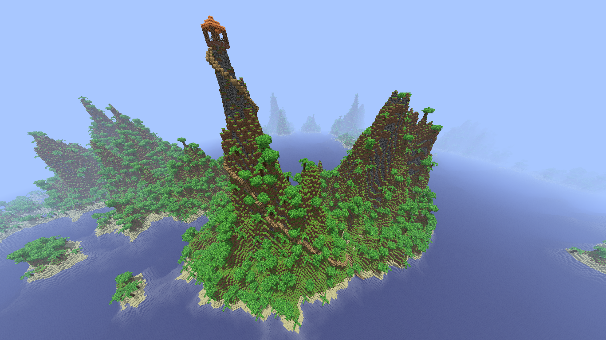
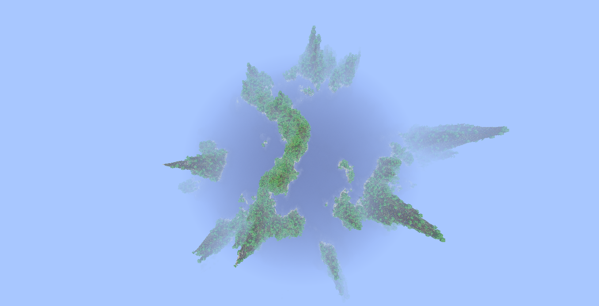

# WorldCraft
WorldCraft is a minecraft clone where you can build massive buildings, fly around an endless world and discover new places.
The project has improved a LOT. the performannce is amazing. It runs smooth on both laptop and PC.

Feel free to contribute to this amazing project!

Currently, we are at version 3.14.

Here is a house at a hilltop:

Fish eye view:

# History
## 2017
### VBA Powerpoint
Here began it all, with powerpoint 3d shapes in MS powerpoint 2007 on winxp. 
After some time, i tested if i could make a 3D-engine myself in powerpoint. The pixels were represented by rectangles, and for each pixel i raycasted through a 3D array of bytes. world gen was really bad.
Performance:
40x40 pixels: 1 second

### VBA Excel
I realised that the cells could be considered as pixels. the cells needed to be coloured, and then refresh. This was a lot faster method.
Performance:
100x100 pixels: 1 second

## 2018
### VB.NET
From this time on, Microsoft Visual Studio was used, on a laptop with win10, 8gb ram and 2 gpu's.
Performance:
50x50 pixels:0.1 seconds

### C# .NET

I saw a video from Hopson, and was inspired by him.
After some time using c#, i discovered perlin noise. I implemented it in the program, and the result was amazing! before, i was averaging values around a point in a wide range to make it look 'smooth', but this was fairly better!
Performance:
300x200 pixels:0.1 seconds

### C# wpf
From now on, i could do it on full screen!
I did not use textures for the sake of performance.
performance:
full screen( 1mp):0.1 seconds.
After some time, the standard 3D library from c# wpf was used.
The lighting was very bad, but the performance was huge!
I also added mobs.
performance:
full screen( 1mp):0.04 seconds.

### c++
Since the last months of 2018, the main language of the project switched to c++. This provided huge performance boosts and optimisations.

I tried saving chunks to files for the second time, but it caused such a lag, that i switched it back the same day.

Shadows are also much better now.
performance:
full screen( 1mp):0.03 seconds.

## 2019
### Github
The project is public on github since 24 april 2019.

# Releases
There will be an excel document, telling about the game mechanics, releases, bugs and fixes.
